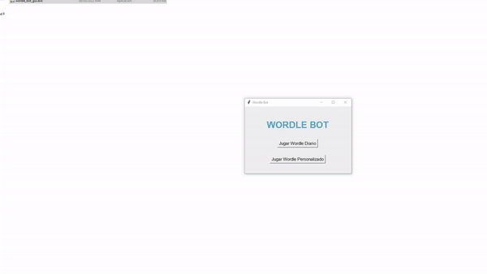

# Wordle_bot




A wordle bot that can solve wordle in spanish consistently. It uses selenium to open a chrome tab with a wordle game and obtain information of the game by scraping the website automatically, then it guess words to solve the game and send them to the website. 

## Install

To run it you can use the executable in the dist folder, only for windows.

On the other hand, the libraries needed to run it with python are selenium and tkinter (only for the gui), to install them:
````
pip install selenium
pip install tk
`````
The script ``play_wordle.py`` allow us to run the daily wordle and a custom wordle, depending the url given in the script.

The script ``test_wordle.py`` allow us to run a test over all the words in the dictionary.

## About it

The bot is based on looking for possible words to reduce the universe of words and then perform a simulation to choose the best words. The performance of the bot can be improved if the variables in the class ``WordleSolver`` _th_to_simulate and _n_to_rank are increased, however this will push the computation time severely. 


## Future

For now the bot use a spanish dictionary however it should work with english dictionaries as well. I will update it in the future. 